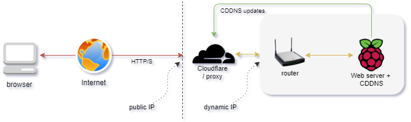
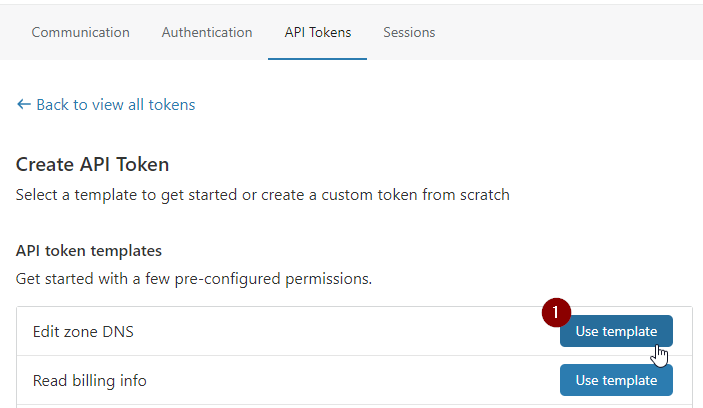

# CDDNS
A DDNS (Dynamic DNS) agent for Cloudflare

## Introduction
CDDNS is an agent that continuously monitors changes in the public Internet IP address of a connection for a host and updates Cloudflare's DNS when a change is detected.


Cloudflare's reverse proxy functionality is supported. A useful use case is when you would like to host a webserver on an Internet connection where the public IP address may change (e.g. home Internet connection) and you would like to hide/protect your home Internet IP address behind Cloudflare. 

An example setup illustrated below has a Raspberry Pi running a webserver with CDDNS on a home Internet connection. The website's domain name (let's use example.com) resolves to Cloudflare's DNS servers. When a web client access example.com, the HTTP/S connection terminates on Cloudflare's infrastructure. Cloudflare then proxies the connection to the home Internet connection where the home router port forwards to the Raspberry Pi. At any time if the home Internet connection IP address changes, CDDNS sends an update informing Cloudflare of the new home IP address for it to proxy to.



The steps to configure a scenario as described above:

- Register a domain name
- Create a free Cloudflare account
- Assign Cloudflare nameservers for the domain name
- Generate a Cloudflare access token
- Install `cddns` on a internal system such as a Raspberry Pi
- Configure port forwarding on router for port 80/443 to the internal system

# Usage

## Installation

### Binaries
Compiled arm and X86_64 executable files for Linux are available [here](https://github.com/x1sec/cddns/releases/).

An example to download and install on a Raspberry Pi. A Cloudflare account is required with an access token ready.
```
wget https://github.com/x1sec/cddns/releases/latest/download/cddns-linux-arm.tar.gz
tar -xf cddns-linux-arm.tar.gz
cd cddns

sudo ./install.sh
```

### Go get
If you would prefer to build yourself (and Go is setup [correctly](https://golang.org/doc/install)):
```
go get -u github.com/x1sec/cddns
```
### Building from source
```
git clone https://github.com/x1sec/cddns
cd cddns
make
```
To compile for arm (e.g. to run on a Raspberry Pi):
```
make build-arm
```
To install as a system service:
```
sudo make install
```

## Running
### Usage options
```
Usage:
   cddns [OPTIONS]

      -s, --setup        Interactive setup menu to create configuration file
      -c, --config-file  Custom location for configuration file
      -d  --debug        Enable debug output
```
`ccdns` requires a configuration file which includes the zone/domain name and a Cloudflare token. This configuration file is generated either by selecting `y` in the system service installation or by running with the `--setup` parameter.
```
$ cddns --setup

Creating configuration
Enter cloudflare token: xxxxxxxxxxxxxx-xxxxxx
Verifying token ...OK!
Enter domain name: example.com
Do you wish to use cloudflare as a proxy (y/n)? y
Poll interval in seconds (default: 120) ?
```

By default the configuration file is written to `$HOME/.config/cddns/config.json`. Specify a custom location with `--config-file` option.
A template for the configuration file:
```json
{
        "ZoneName": "domain_name_here",
        "Token": "token_here",
        "Proxied": true,
        "PollInterval": 120
}
```

### Running as a system service / daemon
An installation script is provided which will install `cddns` as a system service which will start on boot:

```
make install
``` 
If installing from the downloaded compiled release,
```
sudo ./install.sh
```

The installation script creates a new user named `cddns` which the service runs as. The configuration and executable files are copied to the directory `/opt/cddns/`.
To start/stop the service:

```
systemctl start cddns
systemctl stop cddns
```

## Setting up Cloudflare
`cddns` requires a Cloudflare token. After [creating an account with cloudflare](https://support.cloudflare.com/hc/en-us/articles/201720164-Creating-a-Cloudflare-account-and-adding-a-website) and [changing the nameservers](https://support.cloudflare.com/hc/en-us/articles/205195708) in your domain registrar to to Cloudflare, a token needs to generated for `cddns`. 

Tokens can be generated under `My Profile` / `API Tokens`. Select `Edit Zone: Use Template`.



You do not need any `A` records configured in Cloudflare. `cddns` will create an `A` record automatically in Cloudflare if none has been provisioned. `cddns` will modify the first `A` record when a public IP change is detected.
